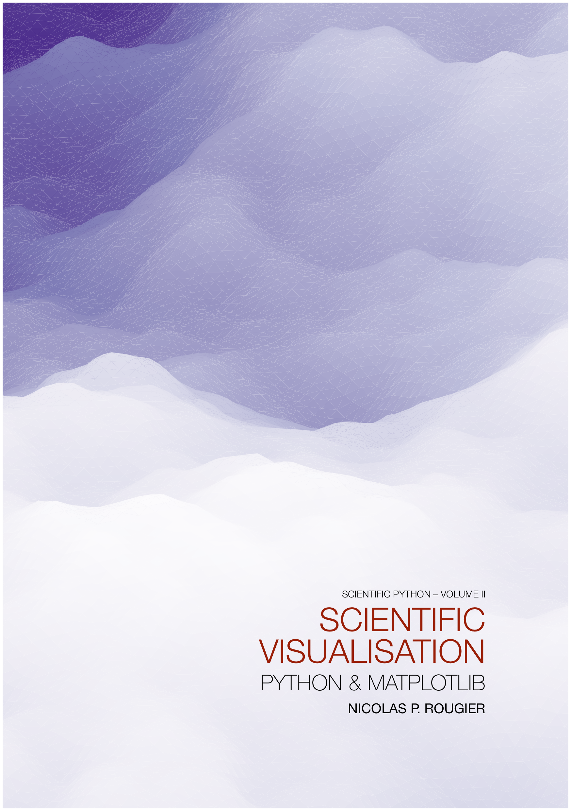

An open access book on scientific visualization using python and matplotlib to
be released by summer 2020 (hopefully). Sources will be available in this
repository, the PDF book will be open-access and the printed book will cost 50$.

If you want to support the book, you can you can [tip a few euros](https://www.paypal.me/NicolasPRougier/10). In the meantime, you can read:

* [Python & OpenGL for Scientific Visualization](https://www.labri.fr/perso/nrougier/python-opengl/)
* [From Python to Numpy](https://www.labri.fr/perso/nrougier/from-python-to-numpy/)
* [100 Numpy exercices](https://github.com/rougier/numpy-100)

