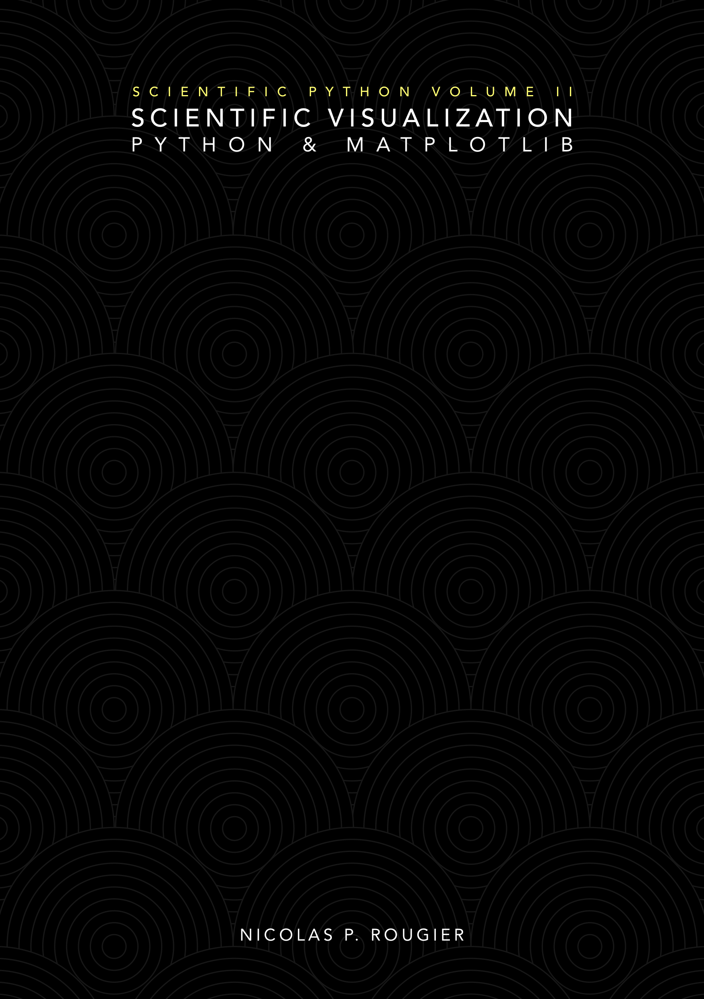
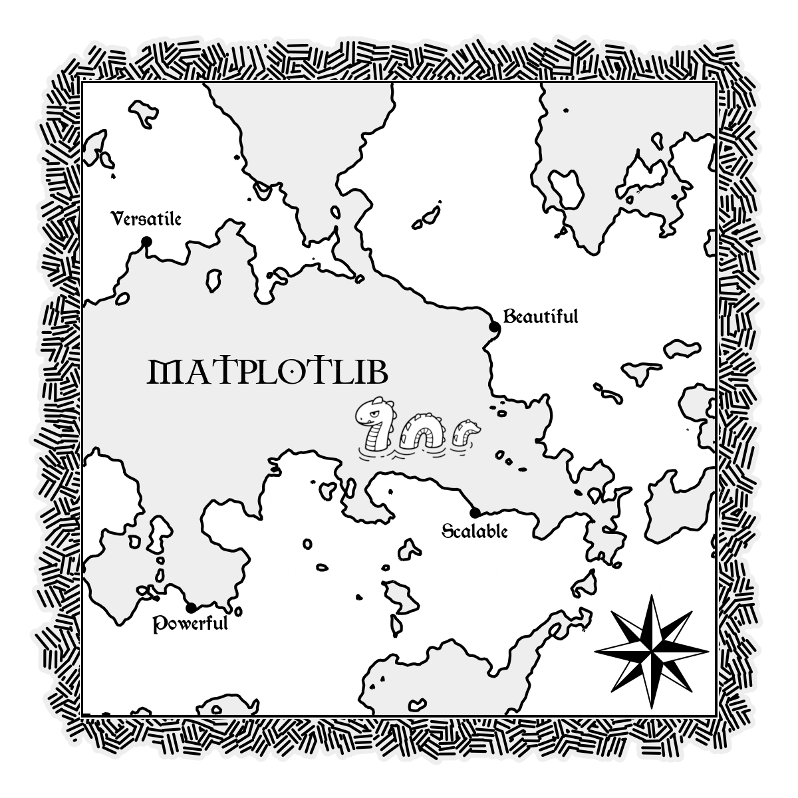

 Scientific Python — Volume II  
**Scientific Visualization – Python & Matplotlib**, Nicolas P. Rougier

An open access book on scientific visualization using python and matplotlib to
be released during summer 2020 (hopefully). Sources will be available in this
repository, the PDF book will be open-access and the printed book will cost 50$.

If you want to support the book, you can:

 * Star the project
 * [Tip a few euros (10 €)](https://www.paypal.me/NicolasPRougier/10)
 * [Access the private repository (25 €)](https://www.paypal.me/NicolasPRougier/25) during the writing  
   (and let me know about your github handle)
 * [Sponsor me](https://github.com/sponsors/rougier) through GitHub sponsorship program
 
Note that in any case, the repository will be made public at the end of the writing and the PDF will be
available for free.

In the meantime and if you're impatient, you can read:

* [Python & OpenGL for Scientific Visualization](https://www.labri.fr/perso/nrougier/python-opengl/)
* [From Python to Numpy](https://www.labri.fr/perso/nrougier/from-python-to-numpy/)
* [100 Numpy exercices](https://github.com/rougier/numpy-100)
* [Matplotlib cheat sheet](https://github.com/rougier/matplotlib-cheatsheet)

### Latest news

You can read them on them [news issue](https://github.com/rougier/scientific-visualization-book/issues/1) and subscribe to this specific issue to get notified about new posts.

### Progress

You can follow progress on the [project tab](https://github.com/rougier/scientific-visualization-book/projects/1)

  
---
 

### Image of the week

The images below come from the book and have been made using matplotlib, of course.  

 **3D projection**  

 **Polar projection**  

 **Scales** (plot + scales)  

 **Matplotlib map** (Contour + lines collection)  

 **Escher style** (Polygons)  

 **Many plots** (plot & fill_between)  

 **Oriented histogram** (axisartist toolkit)  

 **Seasonal plot** (polar plot & patches)  

 **Hatched bars** (bar)  

 **Platonic solids** (PolyCollection)  

 [**Calendar heatmap (github activity)**](https://github.com/rougier/calendar-heatmap) (Imshow, PolyCollection)  

 [**Recursive Voronoi**](https://github.com/rougier/recursive-voronoi) (PolyCollection)  

 **Scatter 3D** (PolyCollection, scatter(s), Ellipses and custom 3D projection)  

 **Text shadow** (TextPath, PolyCollection and imshow)  

 **Boots** (scatter plot)  

